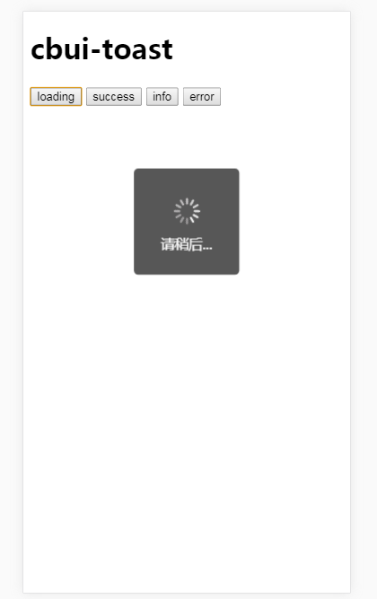
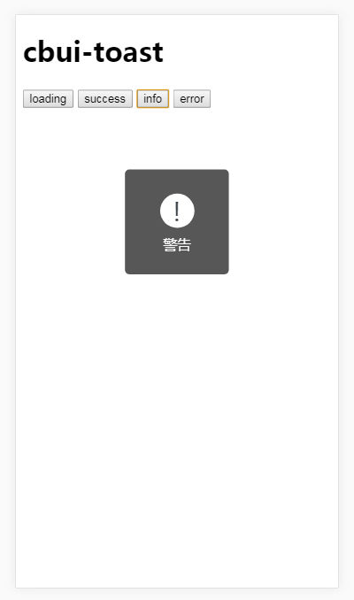
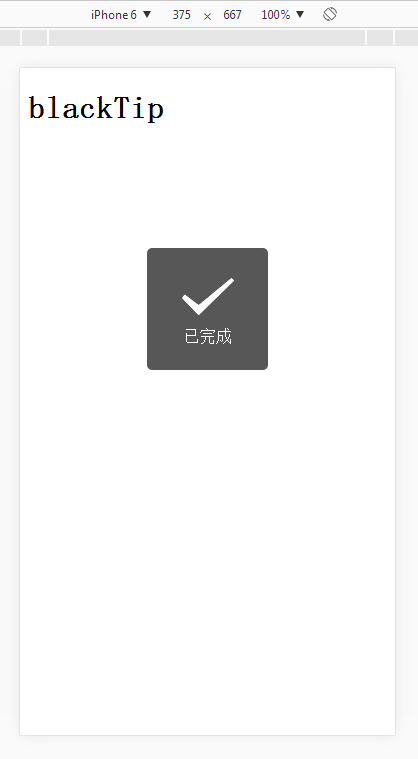
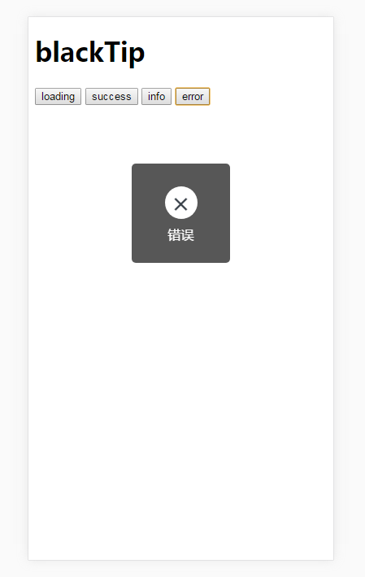

# blackTip

移动端黑色提示，高度还原微信toast的一个轻量级提示插件，原生js实现，gzip压缩之后 只有4Kb
## Screenshot 预览
```js
Toast.loading('数据加载中');
```

```js
Toast.info('加载失败');
```

```js
Toast.success();
```

```js
Toast.error();
```


## Demo
[demo 点击预览](https://yishibakaien.github.io/black-tip/build/index.html)

## Install 安装
#### npm 安装
```shell
$ npm install black-tip --save-dev
```
#### cnpm 淘宝镜像安装
```shell
$ cnpm install black-tip --save-dev
```
#### 页面引用 
```html
<script src="./Toast.js"></script>
```
## Usage 使用 
#### API
- Toast.success() 
> icon - 打钩标志，默认显示时间 800ms， 默认文字 '已完成'
```js

Toast.success('提交成功') // 显示 0.8 秒

Toast.success(1000) // 显示1秒，文字'已完成'

Toast.success('提交成功', 1500) // 显示1.5秒

// 两个参数
Toast.success('提交成功'， { 
    duration: 1000,  // 持续时长，不填默认 800
    complete: function() {
        console.log('我完成了');
    }
});

// 直接跟回调函数，800ms Toast 隐藏后执行
Toast.success('提交成功', function() {
    console.log('我完成了');
});

Toast.success({
    text: '提交成功',
    duration: 600,
    complete: function() {
        console.log('我完成了');
    }
});

```
- Toast.info()  
> icon - 感叹号 '!'，默认显示时间 1500ms，默认文字 '警告'，参数同 Toast.success()

- Toast.error() 
> icon -  '×'，默认显示时间 1500ms ，默认文字 '错误'，参数同 Toast.success()

#### ----分割一下----
- Toast.loading() 
> icon 为旋转的菊花，默认文字为 '请稍后..'，不会自动消失，可以通过  Toast.hide() 方法隐藏，或在参数中传入 duration (持续时长) 值，时间到了后自动隐藏
```js
Toast.loading('正在加载中'， {duration: 3000});
```
- Toast.hide() 
> 随时都可以调用此方法，隐藏正在显示的 Toast，并可传入一个回调函数 会在 Toast 隐藏后执行
```js
Toast.loading('正在加载中');
setTimeout(function() {
    Toast.hide(function(){
        console.log('我隐藏了');
    });
}, 1000);
```

#### Props 参数
###### 根据需求可以传入多种多样的参数

- arguments[0]  第一个参数

| 类型               | 默认             | 说明                                  |
| ---------------- | --------------- | ------------------------------------------|
| string            | ''            | 你要展示的文字    |
| number            |  1500ms                | toast显示时长    |
| function            | 无                 | toast隐藏后的回调函数   |
| object            | 无                 | toast隐藏后的回调函数   |

###### 
- arguments[1] 第二个参数是 object 时

| key              | 类型               | 默认             | 说明                                         |
| ----------------| ---------------- | ---------------| ------------------------------------------|
| text       | String   | -    | 你要展示的文字    |
| duration             | Number            |  1500ms                | toast显示时长    |
| complete             | Function            | -                 | toast隐藏后的回调函数   |
###### 
- arguments[1] 第二个参数是 function 时 
为回调函数，隐藏后执行